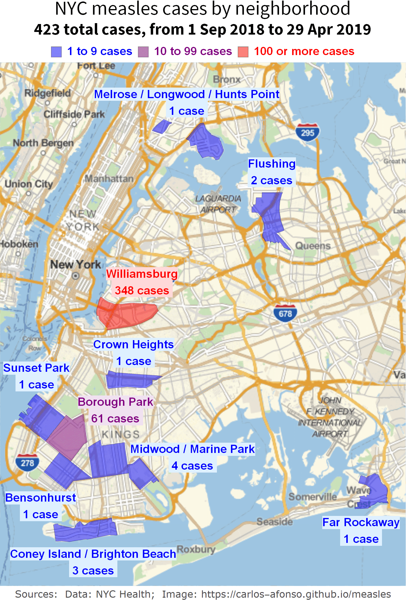
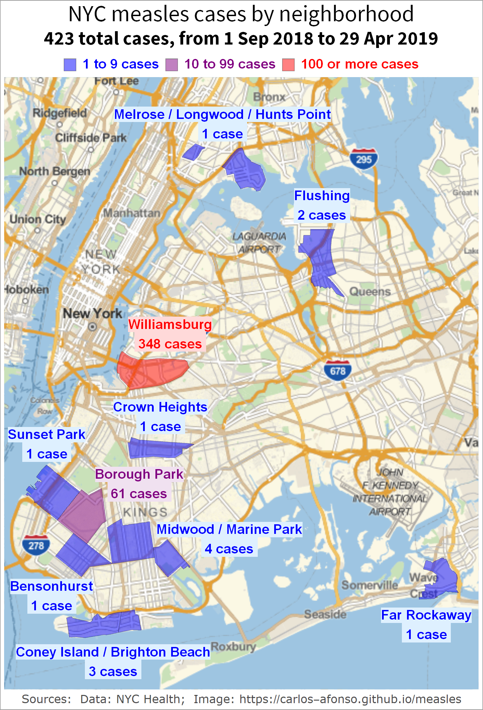
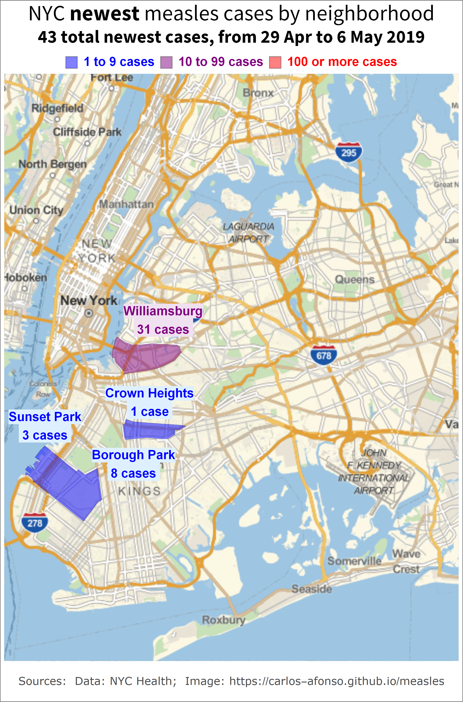
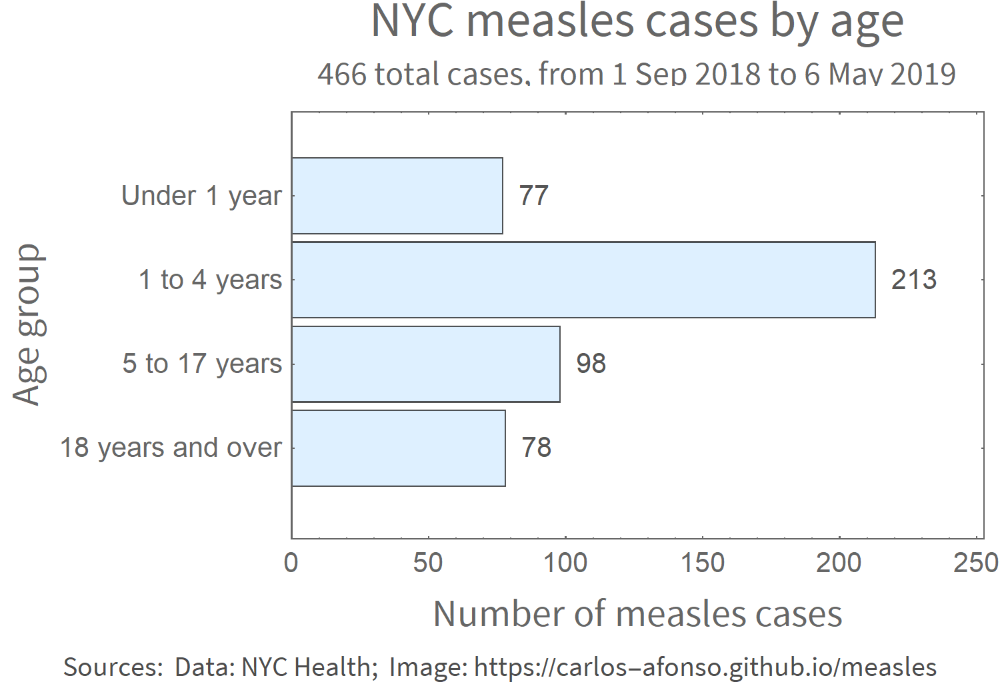
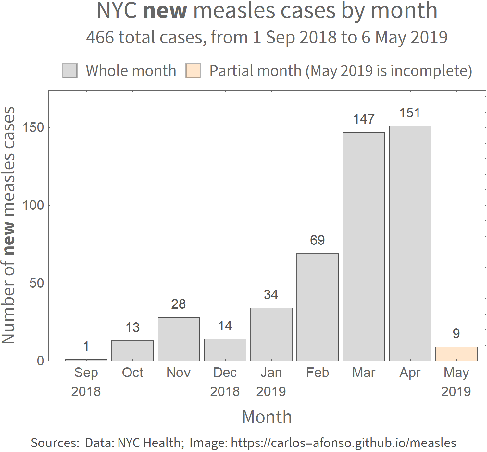

# Visualizing the 2019 Measles Outbreak

Author: [Carlos Afonso](https://www.linkedin.com/in/carlos-afonso-w){:target="&#95;blank" rel="noopener"} | Date: 30 Apr 2019

Helping understand the current Measles Outbreak by transforming raw data into helpful visualizations.

## New York City (NYC)

NYC provides raw data about the number of Measles Cases by Neighborhood, Age and Date on its [NYC Health Measles webpage](https://www1.nyc.gov/site/doh/health/health-topics/measles.page){:target="&#95;blank" rel="noopener"}. Here we visualize that data.

### NYC Measles Cases by Neighborhood

The visualizations in this section highlight the locations of the neighborhoods affected by the Measles Outbreak, on the NYC map.

The animated GIF below shows the NYC Measles Cases by Neighborhood, alternating (every 3 seconds) between the number of **all** cases since the beginning of the outbreak (from 1 Sep 2018 to 29 Apr 2019) and the number of the **newest** cases (from 23 to 29 Apr 2019).

The image below shows the same two images shown in the animated GIF above but now in a static form, side-by-side.

 

Additional notes about the visualizations above:
* The large majority of the Measles cases are in Brooklyn, and specially concentrated in Williamsburg.
* Most of the neighborhoods that have had at least one case of measles are in Brooklyn, but there are also some neighborhoods in Queens (Flushing and Far Rockaway), and in the Bronx (Melrose, Longwood and Hunts Points).
* As per the NYC Health data, the following three sets of neighborhoods have their measles case counts merged: a) Coney Island and Brighton Beach; b) Midwood and Marine Park; and c) Melrose, Longwood and Hunts Points.

### NYC Measles Cases by Age

The bar chart below shows the age distribution of NYC measles cases. Most of the cases are in children, particularly in the ones aged from 1 to 4 years.

### NYC Measles Cases by Date

The graph below shows the NYC Measles Outbreak evolution over time, by comparing the number of **new** Measles cases per month. Note that Aprl 2019 is not complete yet, and is very likelly to get more cases in the next data update.

## Notes

This webpage is for information purposes only, it is not for medical advice. For medical advice refer to the [NYC Health Measles webpage](https://www1.nyc.gov/site/doh/health/health-topics/measles.page){:target="&#95;blank" rel="noopener"} and/or the [CDC Measles webpage](https://www.cdc.gov/measles/index.html){:target="&#95;blank" rel="noopener"}.

This webpage is a work in progress:
* The current visualizations will be updated whenever the corresponding data is updated.
* Additional locations/visualizations will be added soon.

Data sources used:
* [NYC Health Measles webpage](https://www1.nyc.gov/site/doh/health/health-topics/measles.page){:target="&#95;blank" rel="noopener"}

This webpage is part of the [measles](https://github.com/carlos-afonso/measles){:target="&#95;blank" rel="noopener"} GitHub repository, created by [Carlos Afonso](https://www.linkedin.com/in/carlos-afonso-w){:target="&#95;blank" rel="noopener"}.
