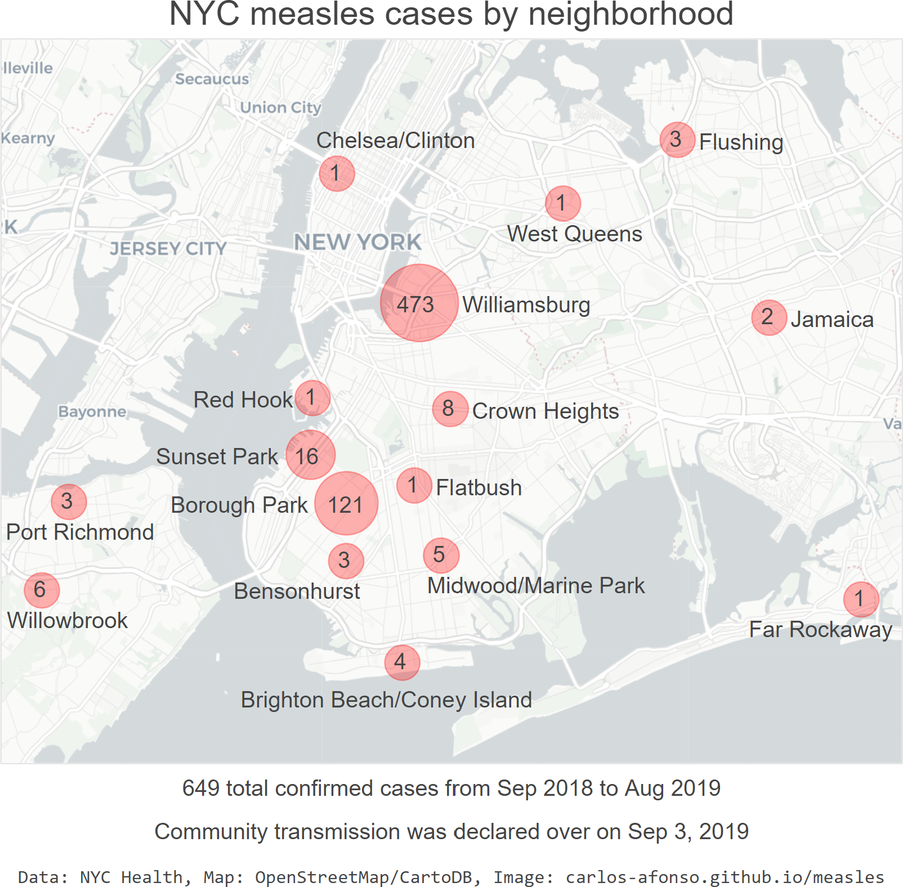

# Visualizing the 2019 Measles Outbreak

(Updated by <a href="https://www.linkedin.com/in/carlos-afonso-w" target="&#95;blank" rel="noopener">Carlos Afonso</a> on October 31, 2019)

The United States is facing, in 2019, the highest number of Measles cases since the disease was eliminated in 2000 [[CDC](https://www.cdc.gov/media/releases/2019/s0424-highest-measles-cases-since-elimination.html)]. From January 1 to October 3, 2019, 1,250 measles cases have been (preliminarily) confirmed in 31 states [[CDC](https://www.cdc.gov/measles/cases-outbreaks.html)]. This page presents visualizations that help understand the 2019 measles outbreak.

## New York City (NYC)

The measles outbreak in New York City (NYC) was declared over on September 3, 2019, practically one year after the first case was detected. With 649 confirmed measles cases, NYC is by far the U.S. jurisdiction with most cases, accounting for around half of all U.S. measles cases in 2019. The [NYC Health Measles webpage](https://www1.nyc.gov/site/doh/health/health-topics/measles.page){:target="&#95;blank" rel="noopener"} provides raw data about the number of measles cases by neighborhood, age, vaccination status, and date. This section presents visualizations of that raw data, to help understand the 2019 measles outbreak in NYC.

### NYC new measles cases by month

The bar chart below shows the temporal evolution of the NYC measles outbreak. In April 2019, at the peak of the measles outbreak, the NYC Health Department took strong measures to increase MMR vaccinations in the most affected neighborhoods. In the following months, the number of new measles cases declined progressively. In August 2019 there were no new cases. On September 3, 2019, community transmission was declared over.

### NYC measles cases by neighborhood

The visualization below shows the geographic distribution of the measles cases over the NYC map, explicitly showing the number of measles cases in each of the affected neighborhoods.

Note that:

* Although most of the NYC neighborhoods with measles cases were in Brooklyn, there were also neighborhoods in Queens (Flushing, Far Rockaway, Jamaica, and West Queens), in Staten Island (Port Richmond, and Willowbrook), and in Manhattan (Chelsea/Clinton).
* West Queens includes the neighborhoods of Corona, Elmhurst,
Jackson Heights, Maspeth, and Woodside, as per this [NYC Health document](https://www1.nyc.gov/assets/doh/downloads/pdf/data/2006chp-402.pdf){:target="&#95;blank" rel="noopener"}.

### NYC measles cases by age

Most of the NYC measles cases are in children, particularly the ones aged from 1 to 4 years.

### NYC measles cases by vaccination status

The bar chart below shows the MMR vaccination status of the NYC measles cases. The large majority of the people who got measles were unvaccinated.

## Notes

This webpage is a work in progress:
* The current visualizations will be updated whenever the corresponding data sources are updated.
* Additional locations / visualizations will be added soon.

This webpage is for information purposes only, it is **not** for medical advice.

<!---
Each of the visualizations above was created using a corresponding Python/Jupyter notebook. These notebooks are available as .ipynb (on GitHub) and as static HTML pages (for easier/faster viewing):

* "NYC Measles Cases by Age" notebook: [.ipynb](https://github.com/carlos-afonso/measles/blob/master/notebooks/nyc-measles-cases-by-age.ipynb){:target="&#95;blank" rel="noopener"} or [.html](https://carlos-afonso.github.io/measles/notebooks/nyc-measles-cases-by-age.html)
--->

Data sources used:
* [NYC Health Measles webpage](https://www1.nyc.gov/site/doh/health/health-topics/measles.page){:target="&#95;blank" rel="noopener"}

This webpage is part of the [measles GitHub repository](https://github.com/carlos-afonso/measles){:target="&#95;blank" rel="noopener"}, created by [Carlos Afonso](https://www.linkedin.com/in/carlos-afonso-w){:target="&#95;blank" rel="noopener"}.
