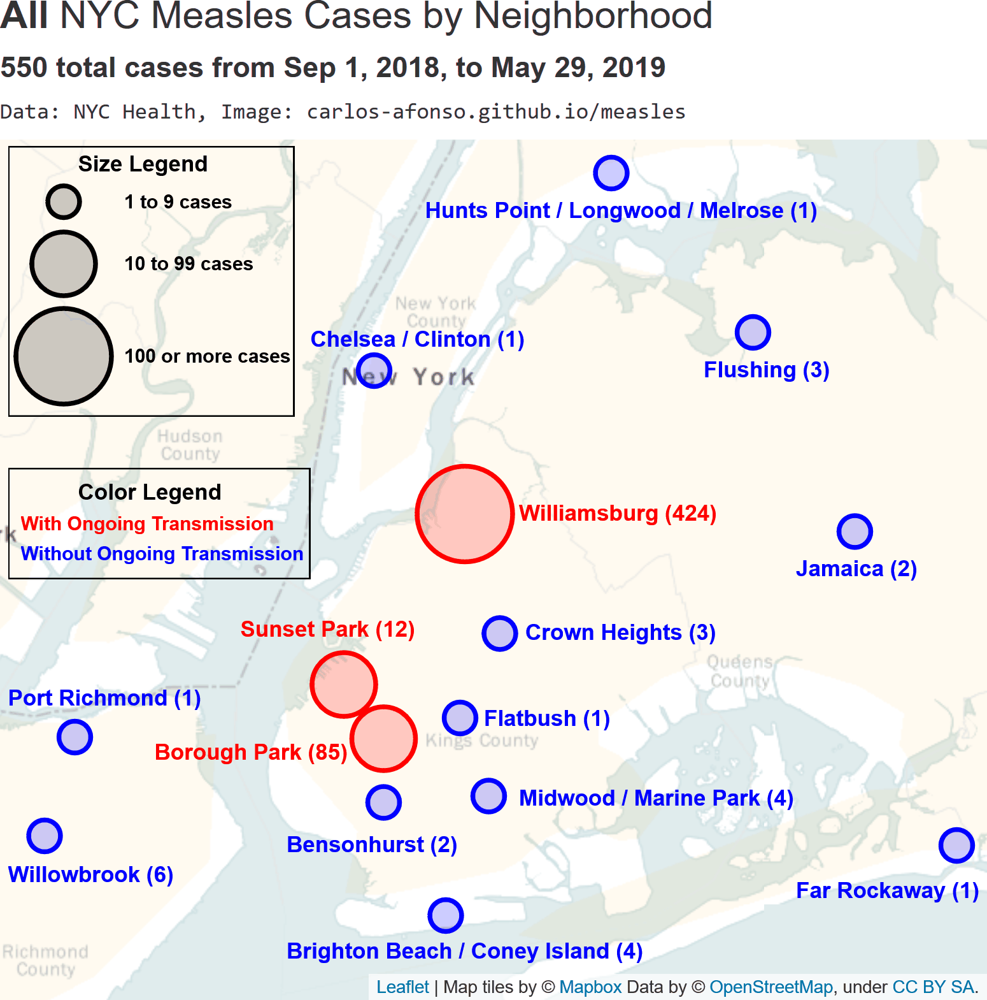
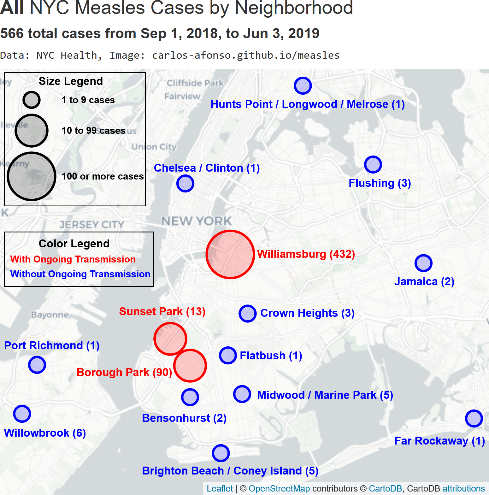
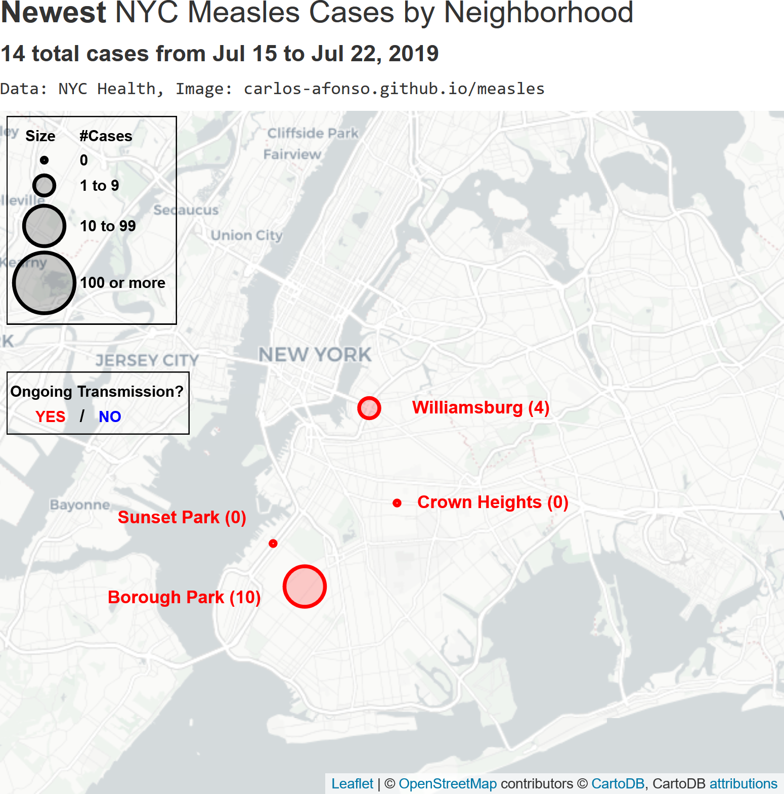
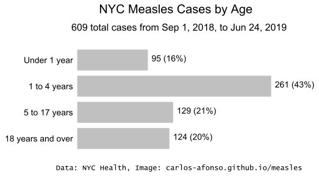
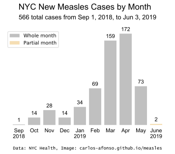

# Visualizing the 2019 Measles Outbreak

(Updated by <a href="https://www.linkedin.com/in/carlos-afonso-w" target="&#95;blank" rel="noopener">Carlos Afonso</a> on June 5, 2019)

Helping understand the current measles outbreak by transforming its raw data into visualizations.

## New York City (NYC)

NYC provides raw data about the number of measles cases by neighborhood, age, vaccination status, and date on its [NYC Health Measles webpage](https://www1.nyc.gov/site/doh/health/health-topics/measles.page){:target="&#95;blank" rel="noopener"}. This section presents visualizations of that data, to help understand the current NYC measles outbreak.

### NYC Measles Cases by Neighborhood

To help understand the geographic distribution of the NYC measles outbreak, the visualizations below highlight the locations of the affected neighborhoods on the NYC map.

The animation below shows the NYC measles cases by neighborhood, alternating (every 5 seconds) between the number of **all** cases since the beginning of the outbreak (from Sep 1, 2018, to Jun 3, 2019) and the number of **newest** cases (from May 29 to Jun 3, 2019). Immediately after, the same two maps are presented in a static form, side-by-side, for easy comparison.

(Note: If you are using a phone, to better see the side-by-side maps below turn to landscape mode or zoom in.)

 

Additional notes about the visualizations above:
* The large majority of the NYC measles cases are concentrated in Williamsburg, Brooklyn.
* Most of the NYC neighborhoods that have had at least one case of measles are in Brooklyn, but there are also neighborhoods in Queens (Flushing, Far Rockaway, and Jamaica), in the Bronx (Melrose, Longwood, and Hunts Points), in Staten Island (Port Richmond, and Willowbrook), and in Manhattan (Chelsea and Clinton).

### NYC Measles Cases by Age

The bar chart below shows the age distribution of the NYC measles cases. Most of the cases are in children, particularly the ones aged from 1 to 4 years.

### NYC Measles Cases by Vaccination Status

The bar chart below shows the MMR vaccination status of the NYC measles cases. The large majority of the people who got measles were unvaccinated.

### NYC Measles Cases by Date

The graph below shows the NYC measles outbreak evolution over time, by comparing the number of **new** measles cases per month. Note that June 2019 is incomplete and is very likely to get more cases in the next data update.

## Notes

This webpage is for information purposes only, it is **not** for medical advice.

This webpage is a work in progress:
* The current visualizations will be updated whenever the corresponding data sources are updated.
* Additional locations / visualizations will be added soon.

Data sources used:
* [NYC Health Measles webpage](https://www1.nyc.gov/site/doh/health/health-topics/measles.page){:target="&#95;blank" rel="noopener"}

This webpage is part of the [measles](https://github.com/carlos-afonso/measles){:target="&#95;blank" rel="noopener"} GitHub repository, created by [Carlos Afonso](https://www.linkedin.com/in/carlos-afonso-w){:target="&#95;blank" rel="noopener"}.
