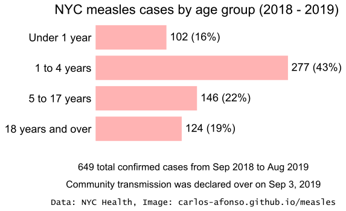
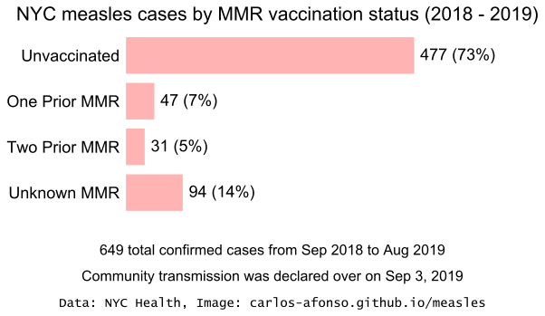
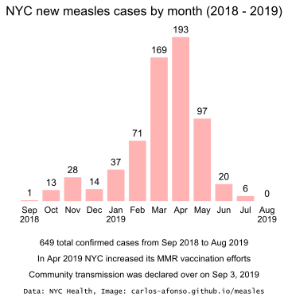

# Visualizing the 2019 Measles Outbreak

(Updated by <a href="https://www.linkedin.com/in/carlos-afonso-w" target="&#95;blank" rel="noopener">Carlos Afonso</a> on July 30, 2019)

Helping understand the current measles outbreak by transforming its raw data into visualizations.

## New York City (NYC)

NYC provides raw data about the number of measles cases by neighborhood, age, vaccination status, and date on its [NYC Health Measles webpage](https://www1.nyc.gov/site/doh/health/health-topics/measles.page){:target="&#95;blank" rel="noopener"}. This section presents visualizations of that data, to help understand the current NYC measles outbreak.

### NYC Measles Cases by Neighborhood

To help understand the geographic distribution of the NYC measles outbreak, the visualizations below highlight the locations of the affected neighborhoods on the NYC map.

The animation below shows the NYC measles cases by neighborhood, alternating (every 5 seconds) between the number of **all** cases since the beginning of the outbreak (from Sep 1, 2018, to Jul 29, 2019) and the number of **newest** cases (from Jul 22 to Jul 29, 2019). Immediately after, the same two maps are presented in a static form, side-by-side, for easy comparison. (Note: If you are using a phone, to better see the side-by-side maps below turn to landscape mode or zoom in.)

 

Additional notes about the visualizations above:

<!---
* The large majority of the NYC measles cases are concentrated in four Brooklyn neighborhoods: Williamsburg, Borough Park, Sunset Park, and Crown Heights. Moreover, currently (as of Jul 22, 2019), these four neighborhoods are the only ones with ongoing measles transmission.
--->

* Although most of the NYC neighborhoods with measles cases are in Brooklyn, there are also neighborhoods in Queens (Flushing, Far Rockaway, Jamaica, West Queens, Long Island City, and Astoria), in the Bronx (Melrose, Longwood, and Hunts Points), in Staten Island (Port Richmond, and Willowbrook), and in Manhattan (Chelsea and Clinton).
* West Queens includes the neighborhoods of Corona, Elmhurst,
Jackson Heights, Maspeth, and Woodside, as per this [NYC Health document](https://www1.nyc.gov/assets/doh/downloads/pdf/data/2006chp-402.pdf){:target="&#95;blank" rel="noopener"}.

### NYC Measles Cases by Age

Most of the NYC measles cases are in children, particularly the ones aged from 1 to 4 years.

### NYC Measles Cases by Vaccination Status

The bar chart below shows the MMR vaccination status of the NYC measles cases. The large majority of the people who got measles were unvaccinated.

### NYC New Measles Cases by Month

The graph below shows the NYC measles outbreak evolution over time, by comparing the number of **new** measles cases per month. It is important to highlight the positive news in this plot: the last two months (May and June 2019) show a significant and progressive decline in the number of new cases, as compared to the peaks from Mar and Apr 2019.

Note that the month of Jul 2019 is incomplete and therefore is likely to get more cases in the next data update. Moreover, due to delayed reporting, the month of Jun 2019 may also get more cases in the next data update.

## Notes

This webpage is for information purposes only, it is **not** for medical advice.

This webpage is a work in progress:
* The current visualizations will be updated whenever the corresponding data sources are updated.
* Additional locations / visualizations will be added soon.

<!---
Each of the visualizations above was created using a corresponding Python/Jupyter notebook. These notebooks are available as .ipynb (on GitHub) and as static HTML pages (for easier/faster viewing):

* "NYC Measles Cases by Age" notebook: [.ipynb](https://github.com/carlos-afonso/measles/blob/master/notebooks/nyc-measles-cases-by-age.ipynb){:target="&#95;blank" rel="noopener"} or [.html](https://carlos-afonso.github.io/measles/notebooks/nyc-measles-cases-by-age.html)
--->

Data sources used:
* [NYC Health Measles webpage](https://www1.nyc.gov/site/doh/health/health-topics/measles.page){:target="&#95;blank" rel="noopener"}

This webpage is part of the [measles GitHub repository](https://github.com/carlos-afonso/measles){:target="&#95;blank" rel="noopener"}, created by [Carlos Afonso](https://www.linkedin.com/in/carlos-afonso-w){:target="&#95;blank" rel="noopener"}.
